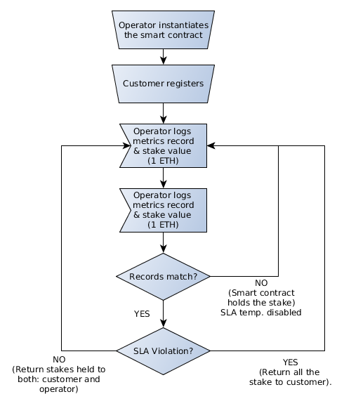
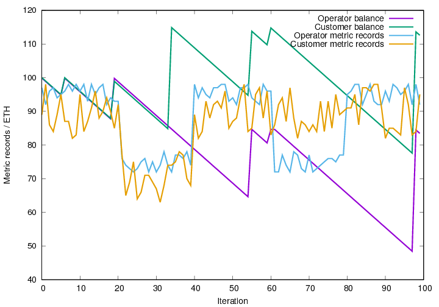

# BCSLA

## Requirements:

- ganache-cli
- truffle framework

## Usage

### Deploy development network

```
ganache-cli -p 7545
```

### Compile, migrate and run test simulation

```
truffle compile && truffle migrate --network development && truffle exec test/testBCLSA.js
```

# Metric record trust between untrusted peers: smart contract approach

## Introduction

Recent publications (view [1] and [2]) analyze the possibility
of making use of blockchain features to handle SLA contract management.

## Monitoring agents

In particular [2] describes a detailed approach about how this SLA management workflow
can be applied to virtualized network functions and services. Anyway
the schema relies on a trusted monitoring solution supported by some agents
lowering a bit the decentralization of the solution.

## Achieving consensus regarding monitoring metrics

Trying to solve the issue about the trusted monitoring and taking as a starting
point the "wrestling" smart-contract presented in [3] one can end up writing some
solidity smart-contract called BCSLA (blockchain SLA). The contract itself is
pretty simple as depicted in the flow diagram below; operator instantiates the
contract into Ethereum Distributed Virtual Machine; customer registers
within the contract instance. From that time on, customer and operator
start posting their metric records (adding some stake to the call, to
keep things simple: 1 ETH per call) with 3 possible outcomes:

1) Records do not match: The smart contract temporary disables the SLA
and holds the 2 ETH transferred by both: customer & operator:

2) Records match and QoS is above the level stated in the SLA; both
customer and operator get back their respective stakes held by the contract.

3) Records match and QoS is below the SLA; it turns out that a SLA
violation has occurred and customer receives back the stake held from
both: operator and customer.



At first sight, may seem a bit drastic to hold customer's cryptos in case
monitoring metrics differ but this behavior should be added to the contract
in order to ensure customer does not try to fake and lower metric
to commit fraud against the operator.

Full code of the smart contract here.

## Initial simulation:

One first simulation to test the contract can be found in the test
directory of the repository; in particular this code
simulates 100 random metric records for each player;
between 20th and 40th, the QoS falls down causing customer compensation;
after that ... between 60th and 80th iterations the provider's monitor
starts malfunctioning causing the contract to hold all the stake
from both of them and eventually returning held value to players
when their metrics converge again just before the simulation finishes.




```
var iterations = 100;
var metrics = [];
for(var i=0;i<iterations;i++) {
    var m1 = randomIntInc(82,98);
    var m2 = randomIntInc(82,98);
    if ( i > 20 && i < 40 ) {
	m1 = m1-20;
	m2 = m2-20;
    }
    if ( i > 60 && i < 80 ) {
	m2 = m2-20;
    }
    metrics.push([m1, m2, 1, 1]);
}
```


## Possible features to extend the contract

- In order to consider the asymmetry between operator and customer
it may be nice to have the operator making an initial transfer
directly proportional to the value of the whole contract duration
(initial proof of stake)
and keep retrieving it while posting correct metrics above the SLA
QoS level until the end of the contract.

- Also consider the possibility to create a SLA management
smart contract that can operate recurrently over different
instances to allow some
SLA chaining between different customers and providers: infrastructure
providers, service vendors, network operators and end-users.


[1] https://www.juniper.net/assets/us/en/local/pdf/whitepapers/2000674-en.pdf

[2] https://files.ifi.uzh.ch/CSG/staff/scheid/extern/publications/IFI-2018.02.pdf

[3] https://hackernoon.com/ethereum-development-walkthrough-part-1-smart-contracts-b3979e6e573e
